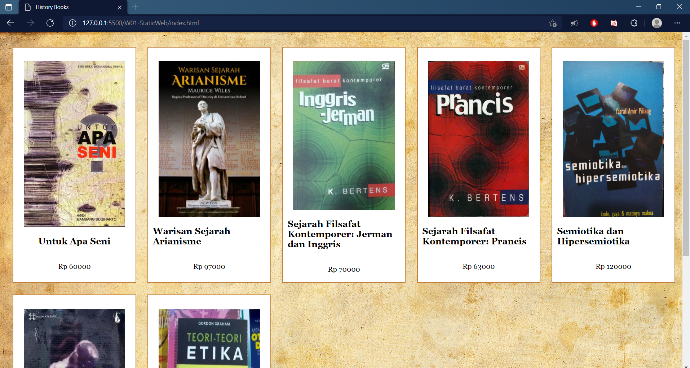
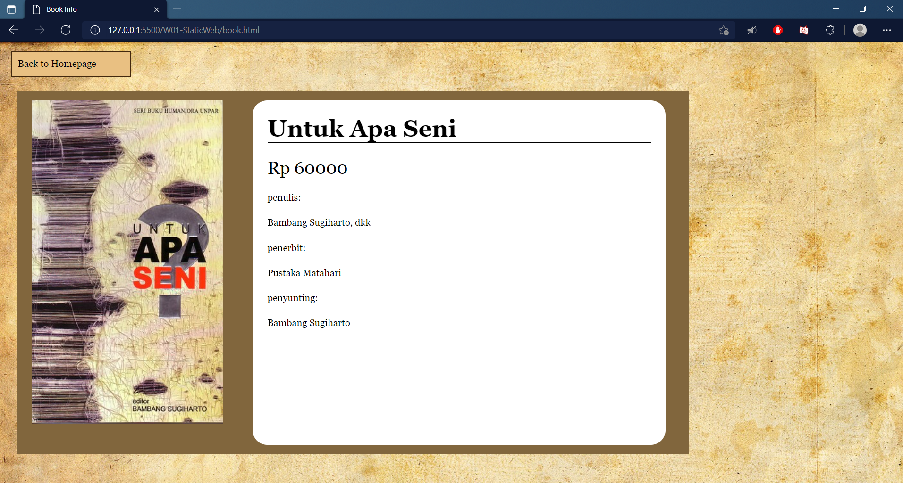
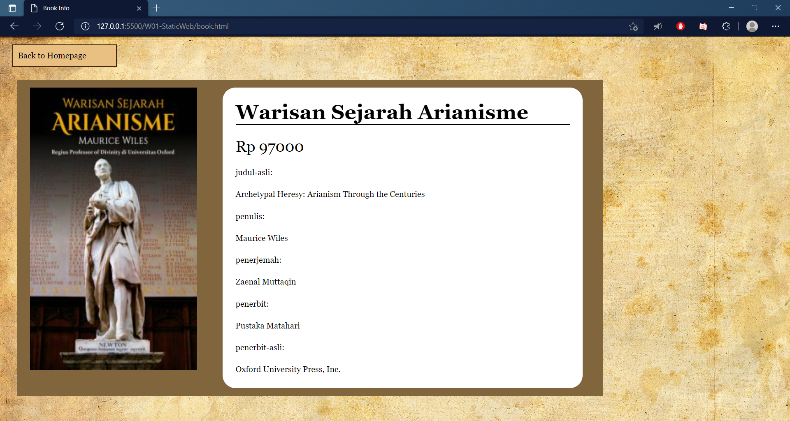
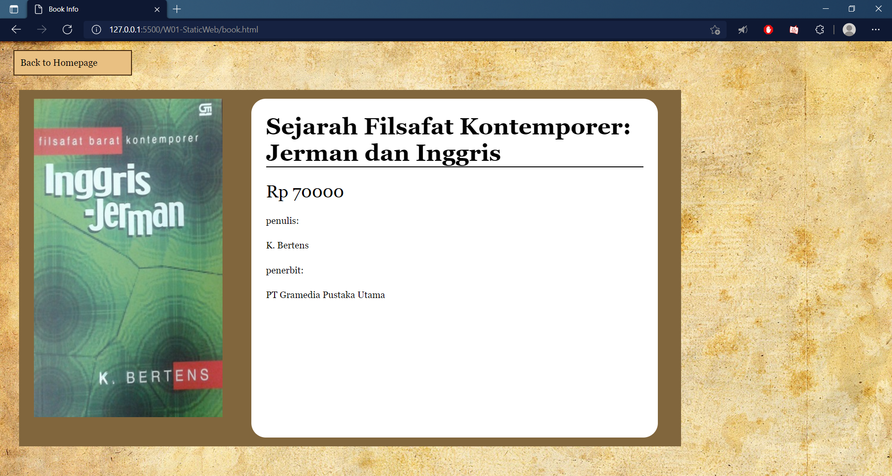
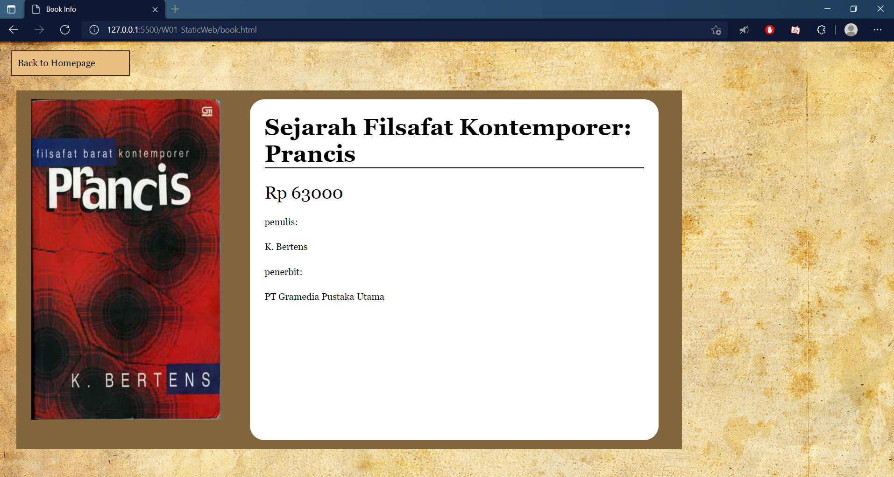
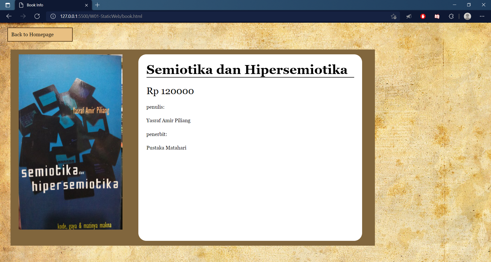
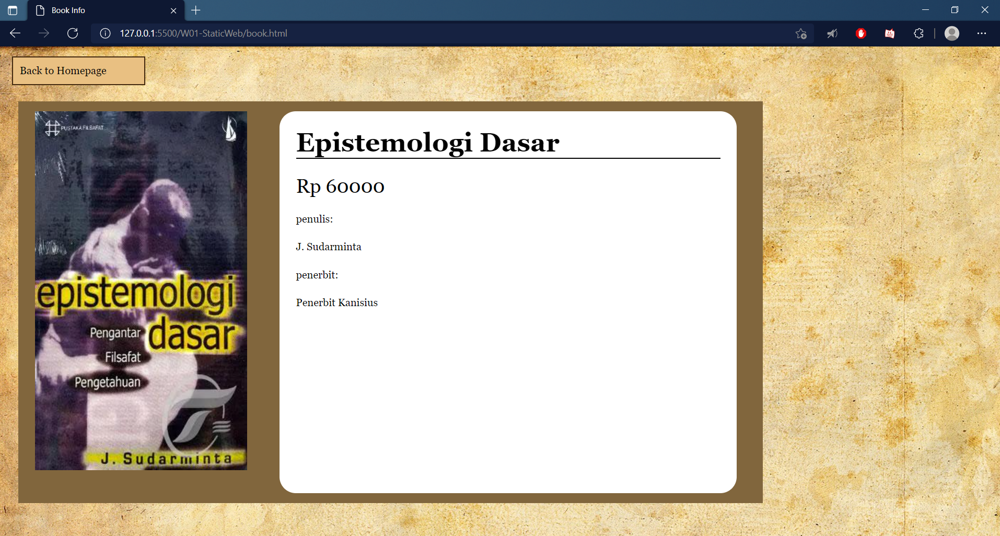
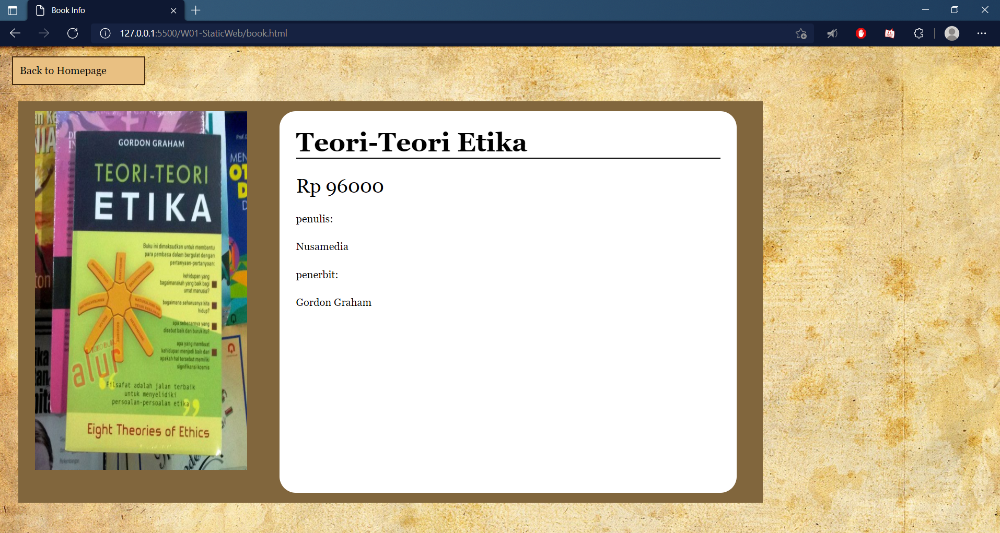

# Tugas Web Static IF3110 WBD 2021

> Sebuah Web static yang berisi pilihan dan detail informasi buku.  

## Info General
Tujuan dari pembuatan proyek ini adalah untuk memenuhi tugas mata kuliah IF3110 Pengembangan Aplikasi Berbasis Web semester 5 Teknik Informatika Institut Teknologi Bandung tahun ajaran 2021/2022.

## Teknologi
* Javascript
* HTML
* CSS

## Overview

## Author
Benidictus Galih Mahar Putra - 13519159 - 13519159@std.stei.itb.ac.id